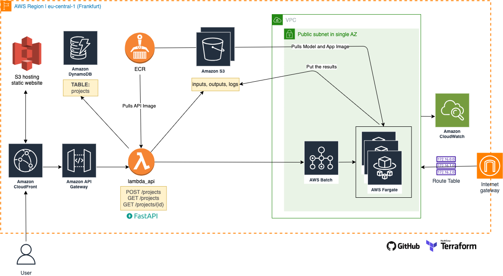
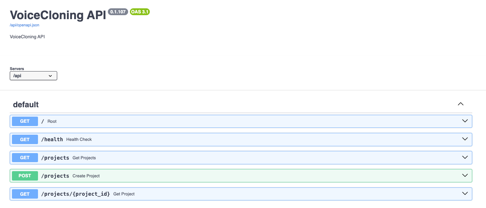

# 🤖 Voice Cloning
- Users upload the audio records and clone the voice for given text.
- Learning, having fun and hands-on experience with AWS & Terraform & Serverless architecture.
- Screen recording of the app:

  https://github.com/user-attachments/assets/551aa3a3-fe2c-4f35-b5a0-c4f711144618

<br>

## 🚀 Tech Stack

### 1. Architecture



---

**Resource links (you can read out them from Terraform outputs):**

| Resource | Link |
|---|---|
| Web via Cloudfront | https://<CDN_WEBAPP_ID>.cloudfront.net/ |
| Web via S3 | http://voicecloning-website.s3-website.eu-central-1.amazonaws.com/ |
| API via Cloudfront | http://<CDN_API_ID>.cloudfront.net/api/docs |
| API via APIGateway | https://<APIGateway_API_ID>.execute-api.eu-central-1.amazonaws.com/api/docs |

### 2. AWS

- Install AWS CLI
- Create a developer user with `AdministratorAccess` to be used by TF
- Configure the ` ~/.aws/credentials` file for the credentials

### 3. Terraform

**How to deploy?**
```bash
chmod +x 'scripts/provision_the_project.sh' && ./scripts/provision_the_project.sh
```

**How to destroy?**
```bash
brew install cloud-nuke
cloud-nuke aws --region eu-central-1
chmod +x './scripts/force_delete_s3.sh' && ./scripts/force_delete_s3.sh
```

### 4. App

```bash
# Local setup
conda create --name VoiceCloning python=3.10 -y
conda activate VoiceCloning
pip install --upgrade pip
pip install -r requirements.txt
python entrypoint.py
```

### 5. API
```bash
# Local setup
cd api
conda activate VoiceCloning
pip install -r requirements.txt
uvicorn main:app --reload
```



## 🛠️ Notes
- If the Cloudfront seems outdated, introduce "Invalidations" with a path:
  ```bash
  # website
  aws cloudfront create-invalidation --distribution-id "E281IVOBPB39H5" --paths "/*"
  # api
  aws cloudfront create-invalidation --distribution-id "EZ0ZFJOIKT14T" --paths "/*"
  ```
- Future: Remove the hardcoded variables in the code base and replace them with environment variables.
- Future: Implement CI/CD to provision the infra and to deploy the app.
- The model is forked and adapted from https://github.com/jnordberg/tortoise-tts.
  * However, this should be changed to main repo https://github.com/neonbjb/tortoise-tts.

<br>

## 👨🏻‍💻 Developer
- Furkan M. Torun | Researcher and Data Scientist
- Website: [furkanmtorun.github.io](https://furkanmtorun.github.io)
- LinkedIn: [@furkanmtorun](https://www.linkedin.com/in/furkanmtorun)
- Twitter: [@furkanmtorun](https://www.twitter.com/furkanmtorun)
- Mail: [furkanmtorun[at]gmail[dot]com](mailto:furkanmtorun@gmail.com) 
- Academics: [Google Scholar Profile](https://scholar.google.com/citations?user=d5ZyOZ4AAAAJ) 

Moreover, please do not hesitate to comment via opening an issue via GitHub if you have any suggestions or feedback!
